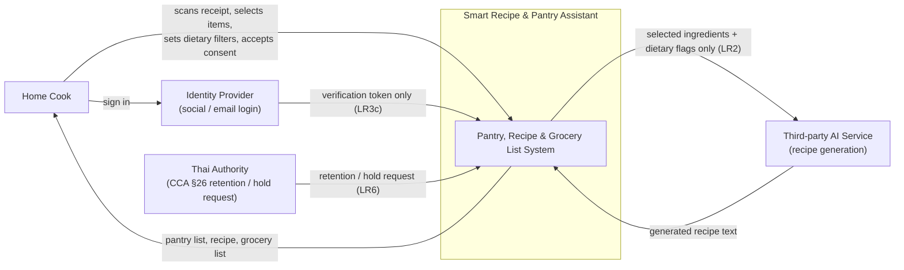

# Diagram 1 of 4 — Context

Shows the system as one box against everything outside it: the Home Cook, the
third-party AI service called for recipe generation (LR2), the identity
provider (LR3c), and the Thai authority that can request log retention under
CCA §26 (LR6).

