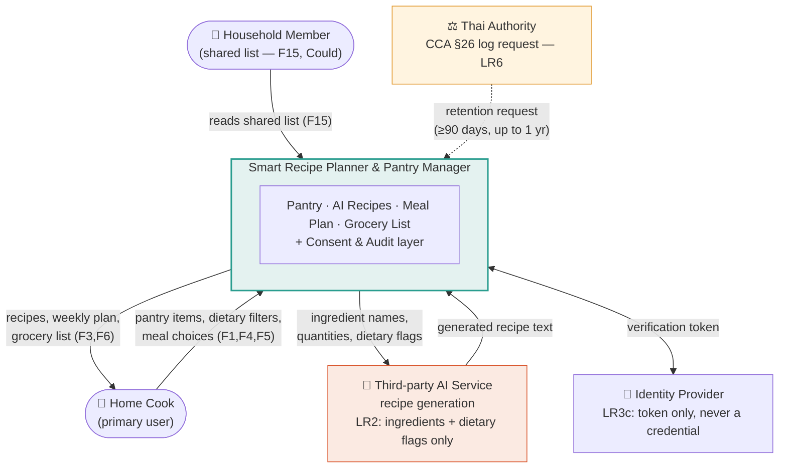

# Diagram 1 of 4 — Context

What we build versus what we call. One box for the system, everything else
outside it.

## What this diagram settles

| Boundary decision | Why |
|---|---|
| Recipe generation is **outside** the box | We call a third-party model; we do not train or host one. This is what makes LR2 (transfer disclosure + minimisation) necessary at all. |
| Identity is **outside** the box | We never store a password — only a verification token (LR3c). |
| The consent & audit layer is **inside** the box | Compliance is our system's job, not the AI vendor's. |
| The Thai authority is an actor, not a user | CCA §26 makes log retention a real external interface, not an internal nicety (LR6). |

**Data leaving the system:** ingredient names, quantities, expiry proximity, and
dietary flags — and nothing else. No name, email, address, or household
identifier crosses the boundary to the AI service (LR2).
