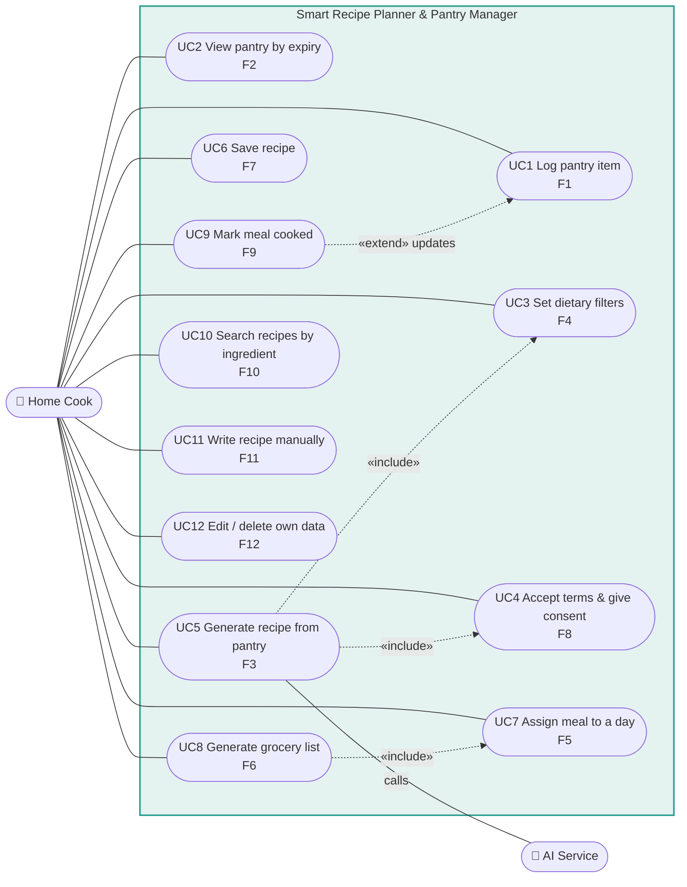

# Diagram 2 of 4 — Use Case

Actors and what each can do. Every use case maps to `F` items in the spec.

## Use case ↔ requirement map

| UC | Use case | Traces | MoSCoW |
|----|----------|--------|--------|
| UC1 | Log pantry item | F1, P1 | Must |
| UC2 | View pantry by expiry | F2, P1 | Must |
| UC3 | Set dietary filters | F4, LR1, P2 | Must |
| UC4 | Accept terms & give consent | F8, LR2, LR7 | Must |
| UC5 | Generate recipe from pantry | F3, LR2, LR8, P1, P2 | Must |
| UC6 | Save recipe | F7, LR4, P2, P3 | Must |
| UC7 | Assign meal to a day | F5, P2, P3 | Must |
| UC8 | Generate grocery list | F6, P1, P3 | Must |
| UC9 | Mark meal cooked | F9, P1, P3 | Should |
| UC10 | Search recipes by ingredient | F10, P1, P2 | Should |
| UC11 | Write recipe manually | F11, P3 | Should |
| UC12 | Edit / delete own data | F12, LR5, P1 | Should |

## The relationships that matter

- **UC5 «include» UC4** — a recipe cannot be generated before consent exists.
  The include is not a convenience; it is LR2 expressed as structure.
- **UC5 «include» UC3** — dietary filters are always applied, never optional
  (NFR5 is 100%).
- **UC8 «include» UC7** — there is no grocery list without a plan; the list is
  derived, never hand-written.
- **UC9 «extend» UC1** — cooking updates the pantry, closing the accuracy loop
  that the Charter names as a top risk.
