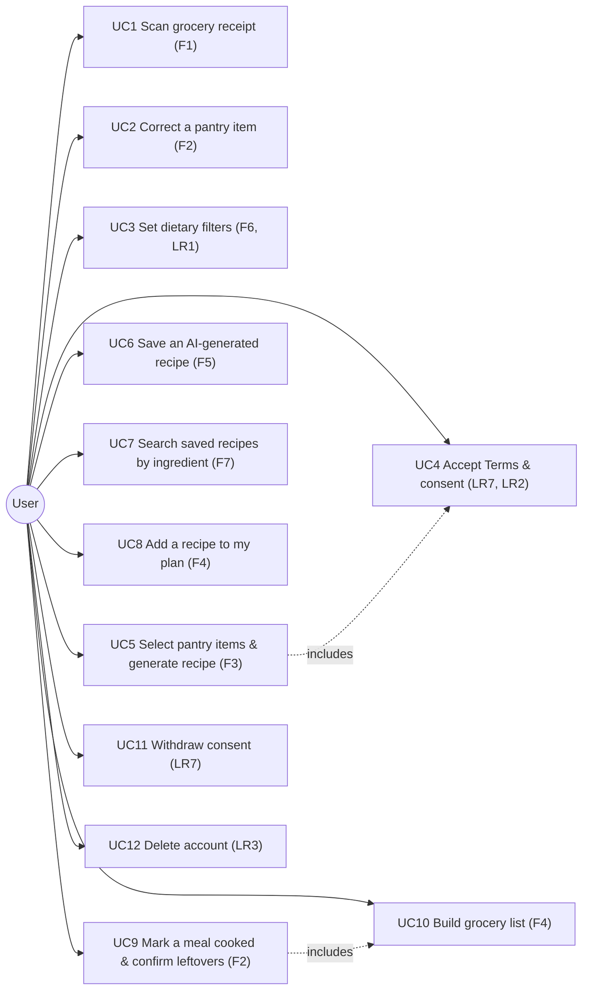

# Diagram 2 of 4 — Use Case

Shows the User actor and every use case they can perform — scan a
receipt, correct the pantry, set dietary filters, accept consent, select
items and generate a recipe, save a recipe, search by ingredient, mark a meal
cooked and confirm leftovers, and build the grocery list — each mapped to its
`F` requirement in the spec. There is no "plan the week" use case — planned
meals are a flat list, not a calendar.

