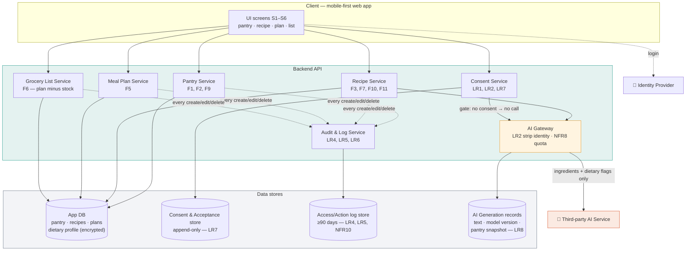

# Diagram 3 of 4 — Architecture

Components, data stores, and where compliance lives.
**The course rubric requires one explicitly stated trade-off — see below.**

## Key structural decisions

| Decision | Reason |
|---|---|
| **AI Gateway is its own component** | One chokepoint where identity is stripped (LR2), quota is enforced (NFR8), and the generation record is written (LR8). Compliance in one testable place instead of scattered through the app. |
| **Four separate stores, not one** | Logs must survive content deletion (LR5) and consent must be append-only (LR7). Different lifecycles cannot share a table. |
| **Consent Service gates the gateway** | LR2 is enforced by the call graph — an ungated path to the AI service does not exist. |
| **Grocery list derives, never stores** | The list is computed from plan minus pantry at request time, so it cannot drift out of date (NFR6). |
| **Dietary profile encrypted at rest** | It is sensitive data under PDPA (LR1). |

## Stated trade-off *(required by the rubric)*

> **We call a third-party AI service instead of self-hosting a model.**
>
> **We gain:** a working recipe generator in month 2 with no ML work, no GPU
> cost, and quality good enough to test the real hypothesis — that cooking from
> the pantry reduces waste. A 5-person team with a 3-week build cannot ship a
> self-hosted model and still deliver the workflow.
>
> **We pay:** per-call cost and rate limits (NFR8 caps free-tier users at 30
> generations/month), an availability dependency we do not control (NFR7 sets
> a 99% uptime target and requires a clear error message, never a raw one),
> and a PDPA cross-border transfer that requires disclosure, consent, and data
> minimisation (LR2). The Charter names AI cost and availability as a top
> risk; NFR7 and NFR8 are the direct answer.
>
> **Revisit when:** generation cost per active user exceeds the free tier at
> scale, or an allergen-safety failure (NFR5) traces to model behaviour we
> cannot constrain by prompt.
