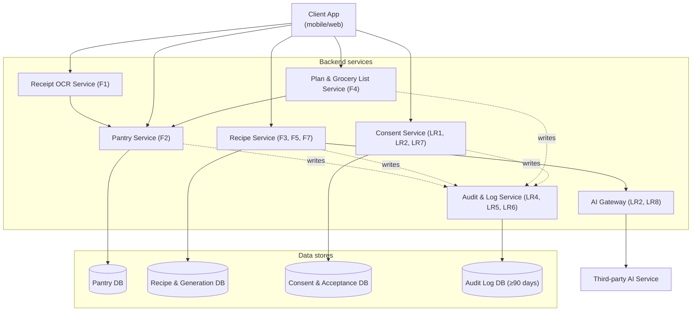

# Diagram 3 of 4 — Architecture

Shows the client, backend services (receipt OCR, pantry, recipe, plan,
grocery list, consent, audit, AI gateway), and the data stores behind them.

**Stated trade-off (course rubric requirement):** Receipt OCR parsing runs
**synchronously** in the request path (client waits for parsed items) rather
than as an async background job. This keeps the scan → review flow on one
screen and meets NFR2's under-1-minute intake target, at the cost of the
client blocking on a slower or lower-quality photo instead of getting an
immediate response with results delivered later.

