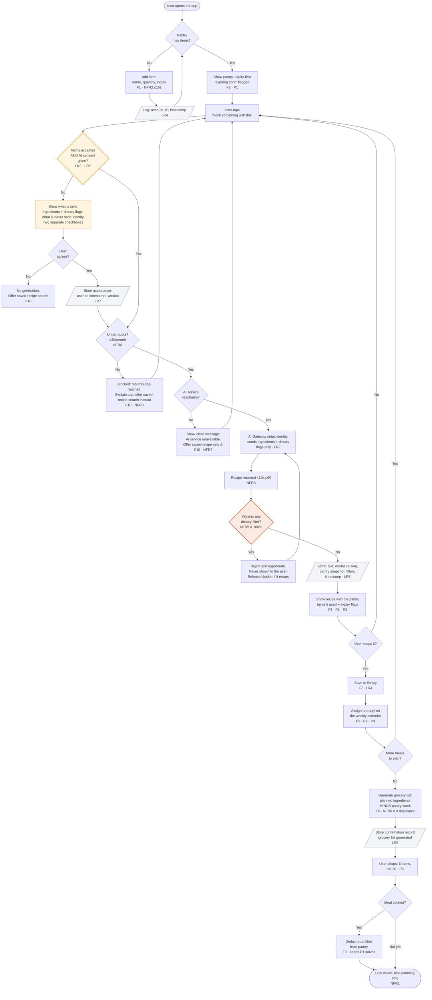

# Diagram 4 of 4 — Activity

The core workflow as a flow, with every decision point.
This is where the consent step (LR1/LR2) and the dietary-filter check (NFR5)
become visible, rather than just claimed in prose.

## Reading the diagram

| Shape | Meaning |
|---|---|
| `{ diamond }` | Decision point |
| `[/ parallelogram /]` | A legally required record is written (LR4, LR7, LR8) |
| Amber | Consent gate — LR1, LR2, LR7 |
| Red | Dietary/allergen check — NFR5, the one 100% requirement |

## The three branches that matter at the gate

1. **No consent → no AI call.** There is no path from "tap cook" to the AI
   service that skips the consent diamond. LR2 is structural, not a promise.
2. **Dietary violation → never shown.** The check sits between generation and
   display, so a bad recipe cannot reach the user. This is NFR5 at 100% and the
   Charter's "AI output quality" risk.
3. **AI down or over quota → no raw error.** Both branches show a clear
   message and point the user to manual saved-recipe search (F10) instead of
   crashing or exposing a raw error (NFR7).
