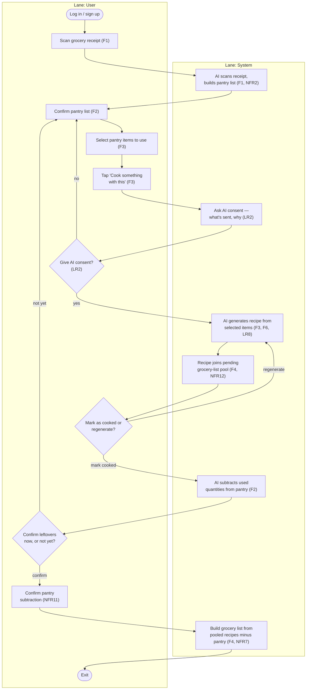

# Diagram 4 of 4 — Activity

Shows the core workflow as a flow with decision points: the consent gate
(LR1/LR2/LR7) before generation, the dietary-filter check (NFR6) before a
recipe is shown, and the AI-availability branch (NFR8) — ending in the
grocery list and the pantry deduction on a cooked meal. There is no
calendar/day-assignment step, and no generation cap (dropped from scope per
Project Proposal v1.1).

Laid out as two swimlanes — **User** (actions and decisions made by the
person using the app) and **System** (app/backend processing, checks, and
records) — to make the handoffs between them explicit.

