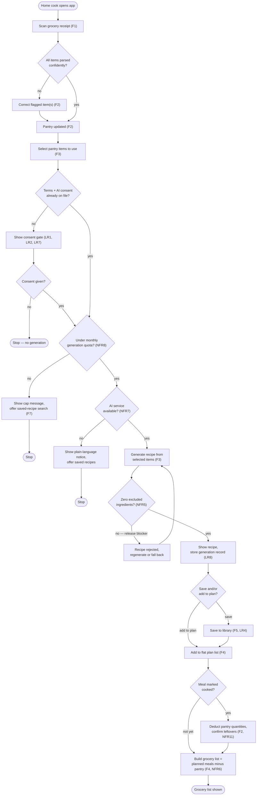

# Diagram 4 of 4 — Activity

Shows the core workflow as a flow with decision points: the consent gate
(LR1/LR2/LR7) before generation, the dietary-filter check (NFR5) before a
recipe is shown, and the quota/AI-availability branches (NFR7, NFR8) —
ending in the grocery list and the pantry deduction on a cooked meal. There
is no calendar/day-assignment step.

